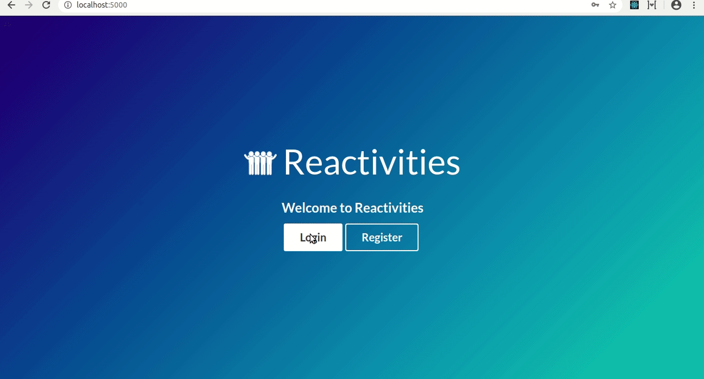

# Reactivities

Reactivities App. An event social networking app used to organize meetings and to find and join activities related to personal interests.

## Demo

## Getting Started

These instructions will get you a copy of the project up and running on your local machine for development and testing purposes. See deployment for notes on how to deploy the project on a live system.

### Prerequisites

Operation System `Linux`, `Windows` or `macOS`. Make sure you have [.NET Core](https://dotnet.microsoft.com/download) and [Node.js](https://nodejs.org) installed globally on your machine.

### Installing

Clone the project into your machine. Go to your terminal and cd into `API` directory. Run `dotnet run` for a dev server. Navigate to `http://localhost:5000/`.

### Building the project

Go to your terminal and cd into `client-app` directory. Run `npm run build` to build the project. The build artifacts will be stored in the `wwwroot` directory inside `API`. 

## Deployment

The app can be published to a web server or a cloud server with minimum configuration.

## Built With

* [.NET Core](https://dotnet.microsoft.com/) - The back-end framework used
* [React](https://create-react-app.dev/) - The front-end JavaScript library used
* [MobX](https://mobx.js.org/) - The state management library used
* [SignalR](https://dotnet.microsoft.com/apps/aspnet/signalr) - The real-time communication notifications library used

## Acknowledgments

This project is based on the course [Complete guide to building an app with .NET Core and React](https://www.udemy.com/course/complete-guide-to-building-an-app-with-net-core-and-react/)

